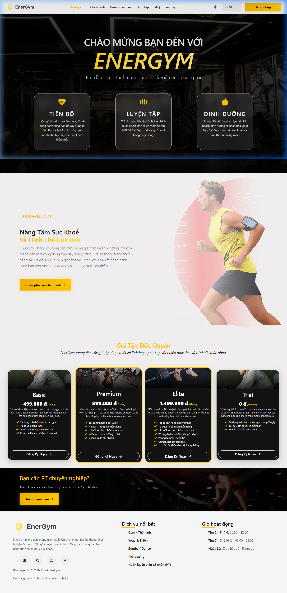
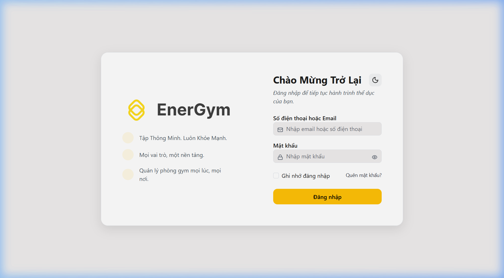
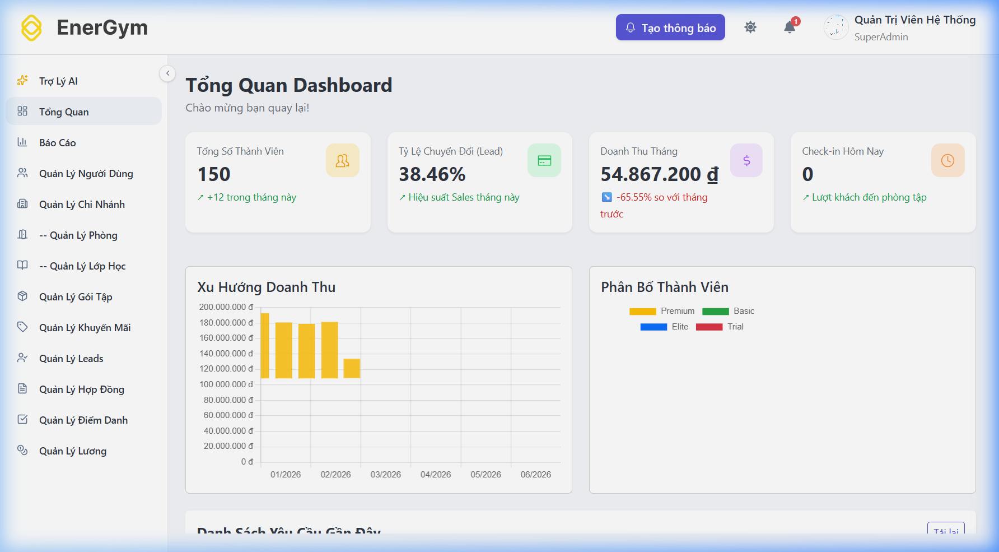
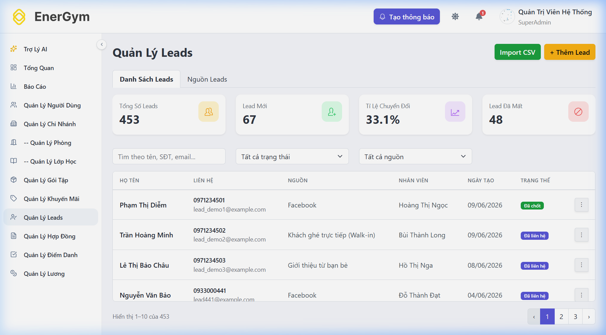
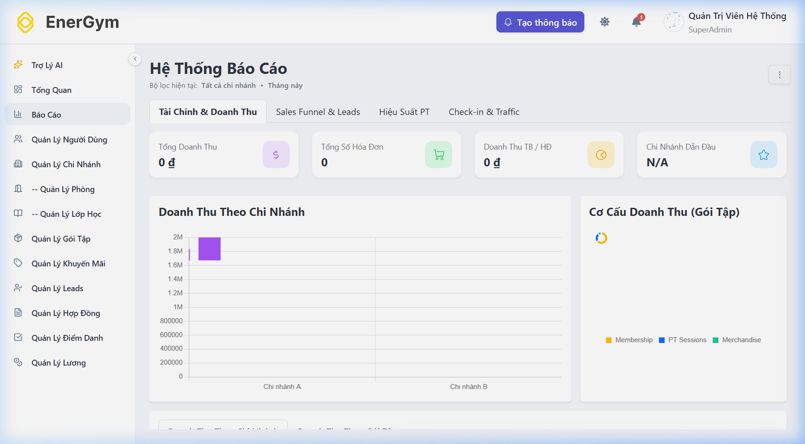
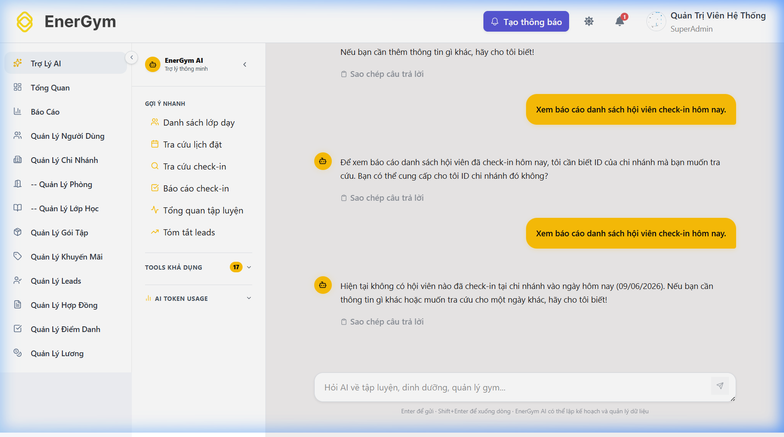
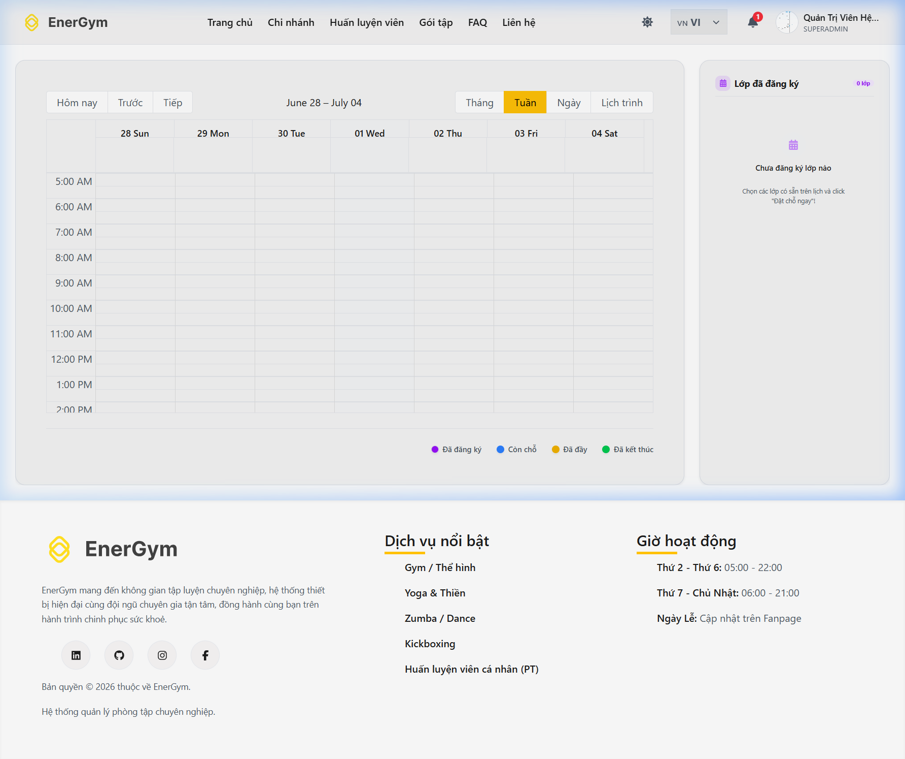

<div align="center">

<h1>🏋️ EnerGym — Gym Management System</h1>

<p>Hệ thống quản lý phòng gym toàn diện: đa chi nhánh, đa vai trò, tích hợp AI Assistant</p>

[](https://energym-gamma.vercel.app/)
[](https://gym-management-system-production-69.up.railway.app/swagger)
[](https://supabase.com/)
[](https://learn.microsoft.com/en-us/semantic-kernel/)
[](https://vercel.com/)
[](https://railway.app/)

<br/>

**[🌐 Live Demo](https://energym-gamma.vercel.app/)** &nbsp;|&nbsp;
**[📖 API Docs (Swagger)](https://gym-management-system-production-69.up.railway.app/swagger)**

</div>

---

## 📋 Mục lục

- [Giới thiệu](#-giới-thiệu)
- [Tính năng](#-tính-năng)
- [Demo & Screenshots](#-demo--screenshots)
- [Tech Stack](#-tech-stack)
- [Kiến trúc hệ thống](#-kiến-trúc-hệ-thống)
- [Vai trò & Phân quyền](#-vai-trò--phân-quyền)
- [Tài khoản Demo](#-tài-khoản-demo)
- [Cài đặt Local](#-cài-đặt-local)
- [Cấu hình Environment](#-cấu-hình-environment)
- [Hướng dẫn Deploy](#-hướng-dẫn-deploy)
- [License](#-license)

---

## 🎯 Giới thiệu

**EnerGym** là hệ thống quản lý phòng gym (Gym Management System) full-stack được xây dựng như đồ án tốt nghiệp. Hệ thống hỗ trợ mô hình **đa chi nhánh** với **6 vai trò** người dùng khác nhau, tích hợp **AI Assistant** sử dụng Microsoft Semantic Kernel để tương tác với dữ liệu phòng gym qua ngôn ngữ tự nhiên.

### Highlights

- 🏢 **Đa chi nhánh** — Super Admin quản lý toàn hệ thống, Branch Admin quản lý từng chi nhánh
- 🤖 **AI Assistant** — Powered by Microsoft Semantic Kernel + GPT-4o-mini với RBAC tool-calling
- 💳 **Thanh toán đa kênh** — VNPay, VietQR (MB Bank)
- 📊 **Báo cáo tài chính** — Dashboard real-time, sales funnel, hiệu suất PT, traffic check-in
- 📅 **Đặt lịch lớp học** — Calendar tương tác với booking management
- 📧 **Hợp đồng & Invoice** — Workflow hợp đồng tự động, email notification
- 🧾 **Quản lý Lead** — CRM pipeline từ lead → thành viên, import CSV, phân công nhân viên
- 💰 **Payroll & Commission** — Tính lương tự động theo công thức, hoa hồng PT

---

## ✨ Tính năng

### 👥 Quản lý người dùng & nhân sự
- Tạo, phân quyền, quản lý tài khoản đa vai trò (Super Admin, Branch Admin, Gym Owner, Staff, PT, Member)
- Profile management với upload ảnh (Cloudinary)
- Lịch sử đăng nhập, audit log

### 🏢 Quản lý chi nhánh
- CRUD chi nhánh, phòng tập (Room) với hình ảnh
- Gán nhân viên/PT vào chi nhánh
- Thông báo nội bộ (Notification system)

### 📦 Gói tập & Khuyến mãi
- Quản lý gói tập (Package) với giá, tính năng, chính sách
- Khuyến mãi theo % hoặc số tiền cố định, giới hạn thời gian/lượt sử dụng

### 📄 Hợp đồng & Thanh toán
- Workflow: Draft → Review → Active → Expired/Cancelled
- Điều chỉnh hợp đồng (ContractAdjust)
- Hóa đơn (Invoice) tự động, thanh toán VNPay / VietQR
- Lịch sử thanh toán

### 🎯 CRM — Quản lý Lead
- Kanban/table view leads với trạng thái đầy đủ
- Phân công lead cho nhân viên, theo dõi nguồn (LeadSource)
- Import hàng loạt qua CSV
- Báo cáo sales funnel, tỷ lệ chuyển đổi

### 🏃 Điểm danh & Lớp học
- Quản lý lịch lớp học, phòng, PT phụ trách
- Đặt chỗ lớp học (booking) với calendar view
- Check-in theo chi nhánh, báo cáo traffic

### 💰 Payroll & Hoa hồng
- Công thức lương linh hoạt (PayrollFormula)
- Tính lương tự động theo tháng
- Hoa hồng PT từ hợp đồng thành viên
- Báo cáo payroll theo chi nhánh

### 🤖 AI Assistant (Semantic Kernel)
- Chat tự nhiên, hỏi đáp dữ liệu phòng gym theo role
- **20+ AI Tools** được phân quyền theo vai trò (RBAC):
  - Member: xem membership, đặt lịch, lịch tập, kế hoạch fitness AI
  - Staff: tra cứu booking, check-in, thông tin thành viên
  - PT: lịch dạy, hoa hồng, hiệu suất
  - Branch Admin / Admin: doanh thu chi nhánh, payroll, leads, dashboard toàn hệ thống
- Hỗ trợ OpenAI (GPT-4o-mini) hoặc Ollama (local LLM)
- Tool invocation audit log

---

## 🖼 Demo & Screenshots

| | |
|:---:|:---:|
|  |  |
| **🌐 Landing Page** | **🔐 Đăng nhập** |
|  |  |
| **📊 Admin Dashboard** | **🎯 Lead Management (CRM)** |
|  |  |
| **📈 Financial Reports** | **🤖 AI Chat Assistant** |
|  | |
| **📅 Class Schedule & Booking** | |

> **Live:** https://energym-gamma.vercel.app/ &nbsp;|&nbsp; **Swagger:** https://gym-management-system-production-69.up.railway.app/swagger

---

## 🛠 Tech Stack

### Backend

| Thành phần | Công nghệ | Version |
|-----------|-----------|---------|
| Framework | ASP.NET Core | .NET 9 |
| ORM | Entity Framework Core | 9.x |
| Database Driver | Npgsql (PostgreSQL) | 9.x |
| Authentication | ASP.NET Core Identity + JWT Bearer | 9.x |
| AI Orchestration | Microsoft Semantic Kernel | 1.30.0 |
| Object Mapping | AutoMapper | 12.x |
| Image Upload | CloudinaryDotNet | 1.27.2 |
| API Documentation | Swashbuckle / Swagger | 6.9.0 |
| Containerization | Docker | — |
| Hosting | Railway | — |

### Frontend

| Thành phần | Công nghệ | Version |
|-----------|-----------|---------|
| Framework | React | 19 |
| Build Tool | Vite | 7 |
| Routing | React Router DOM | v7 |
| UI Components | CoreUI React | 5.x |
| HTTP Client | Axios | 1.x |
| Charts | Chart.js + react-big-calendar | — |
| Icons | Lucide React + React Icons | — |
| Hosting | Vercel | — |

### Infrastructure & Services

| Service | Mục đích |
|---------|---------|
| PostgreSQL (Supabase) | Database chính |
| Cloudinary | Lưu trữ & CDN ảnh |
| OpenAI GPT-4o-mini | AI chat backend |
| VNPay | Cổng thanh toán |
| VietQR (MB Bank) | QR payment |
| Brevo (SMTP) | Gửi email |

---

## 🏗 Kiến trúc hệ thống

```
┌──────────────────────────────────────────────────────────────────┐
│                        EnerGym System                            │
├──────────────────────┬───────────────────────────────────────────┤
│  Frontend (React 19) │     Backend (ASP.NET Core 9)             │
│  ┌────────────────┐  │  ┌─────────────────────────────────────┐ │
│  │ Landing Pages  │  │  │ Controllers (26 endpoints)          │ │
│  │ Admin Portal   │  │  │ Services (31 services)              │ │
│  │ Branch Portal  │  │  │ EF Core + Repository Pattern        │ │
│  │ Staff Portal   │◄─┼──┤ ASP.NET Identity + JWT Auth         │ │
│  │ PT Portal      │  │  │ AutoMapper (DTO mapping)            │ │
│  │ Owner Portal   │  │  │ Semantic Kernel (AI tools)          │ │
│  │ Member Portal  │  │  │ CORS / Middleware pipeline          │ │
│  │ AI Chat        │  │  └─────────────────────────────────────┘ │
│  └────────────────┘  │                  │                        │
│  Vercel Deploy       │  Railway Deploy (Docker)                  │
└──────────────────────┴──────────┬────────────────────────────────┘
                                   │ REST API (JWT Bearer)
              ┌────────────────────┼────────────────────┐
              │                    │                    │
         PostgreSQL           Cloudinary          OpenAI API
        (Supabase)         (Image CDN)       (Semantic Kernel)
```

### Backend Architecture

```
backend/
├── Controllers/        # 26 API Controllers (REST endpoints)
├── Services/           # 31 Business Services (business logic)
├── Interfaces/         # Service contracts
├── Models/             # EF Core domain models (39 entities)
├── DTOs/               # Data Transfer Objects
├── Mappers/            # AutoMapper profiles
├── Data/               # DbContext + DB Seeder
├── Migrations/         # EF Core migrations
├── Middleware/         # Global exception handler
├── Extensions/         # IServiceCollection extensions
├── Options/            # Strongly-typed config
├── Enums/              # Domain enums
├── Helpers/            # Utility classes
└── AI/                 # Semantic Kernel integration
    ├── Core/           # IAITool interface + BaseAITool
    ├── Kernel/         # KernelFactory, SkToolHelper, ToolInvocationFilter
    ├── Tools/          # 20+ AI tools (grouped by domain)
    │   ├── Membership/ # GetMembershipTool, GetAvailablePackagesTool
    │   ├── Booking/    # BookClassTool, CancelBookingTool, ClassRosterTool…
    │   ├── Attendance/ # GetAttendanceSummaryTool, CheckInReportTool…
    │   ├── Lead/       # GetLeadSummaryTool, SalesFunnelTool…
    │   ├── Analytics/  # PTPerformanceTool, MemberLookupTool
    │   ├── Revenue/    # BranchRevenueTool, GlobalRevenueTool, SystemDashboard
    │   ├── Payroll/    # BranchPayrollTool, PayrollOverviewTool, PersonalPayroll
    │   ├── Contract/   # ContractLookupTool
    │   └── Training/   # GenerateFitnessPlanTool, AskFitnessCoachTool
    └── AIToolRegistry.cs  # RBAC tool filtering by Role + StaffPosition
```

### Frontend Architecture

```
frontend/src/
├── app/
│   ├── router/         # React Router v7 config (6 role-based layouts)
│   ├── layouts/        # LandingLayout, AdminLayout, StaffLayout, PtLayout, OwnerLayout, BranchAdminLayout
│   ├── guards/         # Route protection
│   ├── hooks/          # App-level hooks
│   └── utils/          # Shared utilities
├── features/
│   ├── landing/        # Public pages (home, branches, classes, member profile)
│   ├── auth/           # Login, OTP, forgot/reset password
│   ├── super-admin/    # 14 admin pages (dashboard, users, leads, payroll…)
│   ├── branch-admin/   # 12 branch admin pages
│   ├── staff/          # 6 staff pages (dashboard, payments, commissions…)
│   ├── pt/             # 5 PT pages (classes, commissions, payroll…)
│   ├── gym-owner/      # 5 owner pages (reports, payroll, requests…)
│   ├── payment/        # VNPay confirm & return pages
│   └── ai/             # AI Chat page
└── shared/
    ├── components/     # Reusable UI components
    ├── services/       # API service layer (axios)
    ├── contexts/       # React context (auth, etc.)
    ├── hooks/          # Shared hooks
    ├── modals/         # Reusable modals
    └── form-controls/  # Form components
```

---

## 👤 Vai trò & Phân quyền

| Vai trò | Đường dẫn | Quyền hạn |
|---------|-----------|-----------|
| **Super Admin** | `/admin` | Toàn bộ hệ thống: users, branches, packages, leads, payroll, reports, tất cả chi nhánh |
| **Branch Admin** | `/branch-admin` | Quản lý 1 chi nhánh: users, rooms, classes, leads, payroll chi nhánh |
| **Gym Owner** | `/owner` | Xem báo cáo, duyệt yêu cầu từ chi nhánh, quản lý payroll, xem hợp đồng |
| **Staff (Sales)** | `/staff` | Xử lý hợp đồng, thanh toán, leads, hoa hồng, điểm danh |
| **PT (Personal Trainer)** | `/pt` | Quản lý lớp học, xem hoa hồng, payroll cá nhân |
| **Member** | `/`, `/profile`, `/classes` | Đặt lịch tập, xem gói, profile, AI chat |

### AI Tools theo Role

| Role | AI Tools Available |
|------|-------------------|
| Member | Xem membership, đặt/hủy lịch, lịch cá nhân, kế hoạch fitness, AI coach |
| Staff | Tra cứu thành viên, danh sách lớp, check-in hôm nay, lead summary |
| PT | Lịch dạy, hiệu suất cá nhân, danh sách học viên, payroll cá nhân |
| Branch Admin | Doanh thu chi nhánh, payroll chi nhánh, leads pipeline, check-in report |
| Super Admin | Dashboard toàn hệ thống, global revenue, system-wide payroll, tất cả tools |

---

## 🔑 Tài khoản Demo

> Tất cả tài khoản dùng password: **`123456Aa@`**

| Vai trò | Email | Đường dẫn |
|---------|-------|-----------|
| Super Admin | `superadmin@gymfit.vn` | [/admin](https://energym-gamma.vercel.app/admin) |
| Gym Owner | `gymowner@gymfit.vn` | [/owner](https://energym-gamma.vercel.app/owner) |
| Branch Admin | `branchadmin.q1@gymfit.vn` | [/branch-admin](https://energym-gamma.vercel.app/branch-admin) |
| PT | `pt.nguyen@gymfit.vn` | [/pt](https://energym-gamma.vercel.app/pt) |
| Staff (Sales) | `sales.q1@gymfit.vn` | [/staff](https://energym-gamma.vercel.app/staff) |
| Member | `nguyen.van.an@gmail.com` | [/profile](https://energym-gamma.vercel.app/profile) |

---

## 🚀 Cài đặt Local

### Yêu cầu

- [.NET 9 SDK](https://dotnet.microsoft.com/download/dotnet/9.0)
- [Node.js 20+](https://nodejs.org/) và npm
- [PostgreSQL](https://www.postgresql.org/) (hoặc dùng Supabase)
- Git

### 1. Clone repository

```bash
git clone https://github.com/Anhhoang69/gym-management-system.git
cd gym-management-system
```

### 2. Cài đặt Backend

```bash
cd backend

# Tạo file cấu hình local (sẽ được .gitignore tự động)
cp appsettings.json appsettings.Local.json
# Sau đó chỉnh sửa appsettings.Local.json với credentials của bạn
```

Chỉnh sửa `backend/appsettings.Local.json`:

```json
{
  "Jwt": {
    "Key": "YourSuperSecretJwtKeyAtLeast32Characters!"
  },
  "AI": {
    "OpenAI": {
      "ApiKey": "sk-..."
    }
  },
  "Cloudinary": {
    "CloudName": "your-cloud-name",
    "ApiKey": "your-api-key",
    "ApiSecret": "your-api-secret"
  },
  "EmailSettings": {
    "Host": "smtp.gmail.com",
    "Port": "587",
    "Username": "your-email@gmail.com",
    "Password": "your-app-password",
    "FromEmail": "your-email@gmail.com"
  },
  "ConnectionStrings": {
    "DefaultConnection": "Host=localhost;Port=5432;Database=gymdb;Username=postgres;Password=your-password"
  }
}
```

```bash
# Chạy migrations (tạo database)
dotnet ef database update

# Khởi động backend (port 5285)
dotnet run
```

Backend sẽ chạy tại: `http://localhost:5285`  
Swagger UI: `http://localhost:5285/swagger`

### 3. Cài đặt Frontend

```bash
cd frontend

# Copy file env
cp .env.example .env
# Chỉnh sửa .env nếu cần

# Cài dependencies
npm install

# Chạy dev server (port 5173)
npm run dev
```

Frontend sẽ chạy tại: `http://localhost:5173`

---

## ⚙️ Cấu hình Environment

### Backend — `appsettings.json` (public) + `appsettings.Local.json` (private, gitignored)

| Key | Mô tả | Ví dụ |
|-----|-------|-------|
| `Jwt:Key` | JWT signing key (min 32 ký tự) | `"MySuperSecretKey..."` |
| `Jwt:Issuer` | JWT issuer | `"gym-management-system"` |
| `Jwt:ExpiryMinutes` | Token TTL (phút) | `60` |
| `AI:Provider` | AI provider: `"OpenAI"` hoặc `"Ollama"` | `"OpenAI"` |
| `AI:OpenAI:ApiKey` | OpenAI API key | `"sk-..."` |
| `AI:OpenAI:Model` | Model name | `"gpt-4o-mini"` |
| `AI:Ollama:BaseUrl` | Ollama server URL (nếu dùng Ollama) | `"http://localhost:11434"` |
| `Cloudinary:CloudName` | Cloudinary cloud name | `"my-cloud"` |
| `Cloudinary:ApiKey` | Cloudinary API key | `"123456789"` |
| `Cloudinary:ApiSecret` | Cloudinary API secret | `"secret"` |
| `EmailSettings:Host` | SMTP host | `"smtp.gmail.com"` |
| `EmailSettings:Port` | SMTP port | `"587"` |
| `EmailSettings:Username` | SMTP username | `"user@gmail.com"` |
| `EmailSettings:Password` | SMTP password / app password | `"xxxx xxxx xxxx"` |
| `VietQR:BankId` | Mã ngân hàng VietQR | `"MB"` |
| `VietQR:AccountNo` | Số tài khoản | `"0123456789"` |
| `VNPay:TmnCode` | VNPay terminal code | `"XXXXXXXX"` |
| `VNPay:HashSecret` | VNPay hash secret | `"XXXX..."` |
| `ConnectionStrings:DefaultConnection` | PostgreSQL connection string | `"Host=...;Database=..."` |

### Frontend — `.env`

| Key | Mô tả | Default |
|-----|-------|---------|
| `VITE_API_BASE_URL` | URL gốc của backend API | `http://localhost:5285/api` |

---

## 📦 Hướng dẫn Deploy

### Backend → Railway

1. Tạo project trên [Railway](https://railway.app/)
2. Connect GitHub repository
3. Railway sẽ tự detect `railway.json` và dùng `backend/Dockerfile`
4. Set environment variables trong Railway dashboard (thay thế toàn bộ values trong `appsettings.Local.json`):

```
ConnectionStrings__DefaultConnection=Host=...;Database=...
Jwt__Key=YourProductionJwtKey
AI__OpenAI__ApiKey=sk-...
Cloudinary__CloudName=...
Cloudinary__ApiKey=...
Cloudinary__ApiSecret=...
EmailSettings__Host=...
EmailSettings__Username=...
EmailSettings__Password=...
VNPay__TmnCode=...
VNPay__HashSecret=...
VNPay__ReturnUrl=https://your-frontend.vercel.app/payment/vnpay/return
VNPay__IpnUrl=https://your-backend.railway.app/api/payments/vnpay/ipn
AppUrl=https://your-frontend.vercel.app
RUN_MIGRATIONS=true
```

5. Deploy! Railway tự build Docker image và run.

### Frontend → Vercel

1. Import GitHub repository trên [Vercel](https://vercel.com/)
2. Set **Root Directory**: `frontend`
3. Set environment variables:
   ```
   VITE_API_BASE_URL=https://your-backend.railway.app/api
   ```
4. Vercel tự detect Vite và build
5. File `frontend/vercel.json` đã cấu hình SPA routing (rewrites → index.html)

---

## 📁 Cấu trúc thư mục

```
gym-management-system/
├── backend/                    # ASP.NET Core 9 Web API
│   ├── AI/                     # Microsoft Semantic Kernel + AI Tools
│   ├── Controllers/            # 26 REST API Controllers
│   ├── Services/               # 31 Business Services
│   ├── Models/                 # 39 EF Core Domain Models
│   ├── DTOs/                   # Data Transfer Objects
│   ├── Data/                   # DbContext + Seed data
│   ├── Migrations/             # EF Core migrations
│   ├── Dockerfile              # Docker config (Railway deploy)
│   ├── appsettings.json        # Config template (no secrets)
│   └── appsettings.Local.json  # Local secrets (gitignored ✗)
├── frontend/                   # React 19 + Vite
│   ├── src/
│   │   ├── app/                # Router, layouts, guards
│   │   ├── features/           # Feature modules by role
│   │   └── shared/             # Shared components & services
│   ├── .env.example            # Environment template
│   └── vercel.json             # Vercel SPA routing config
├── docs/                       # AI Architecture documentation
├── railway.json                # Railway deployment config
└── README.md
```

---

## 🔐 Bảo mật

- JWT Bearer Authentication với ASP.NET Core Identity
- Tất cả secrets được inject qua environment variables (không hardcode trong git)
- `appsettings.Local.json` được `.gitignore` — không bao giờ commit lên git
- Password hash bằng ASP.NET Identity (PBKDF2 + salt)
- CORS được cấu hình cho phép frontend domain

---

## 📜 License

[MIT License](LICENSE)

---

<div align="center">

Made with ❤️ | Đồ án tốt nghiệp 2026

**[🌐 Live Demo](https://energym-gamma.vercel.app/)** &nbsp;|&nbsp;
**[📖 Swagger API](https://gym-management-system-production-69.up.railway.app/swagger)**

</div>