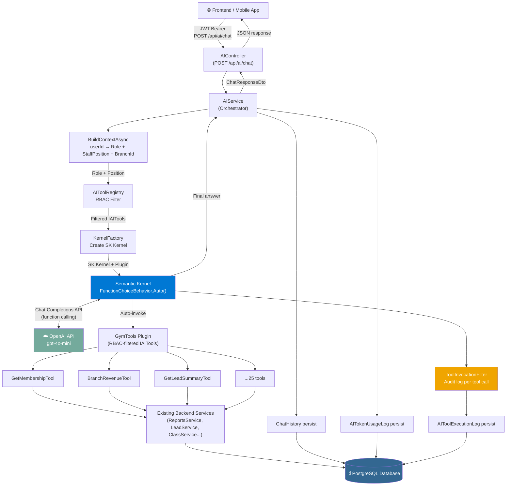
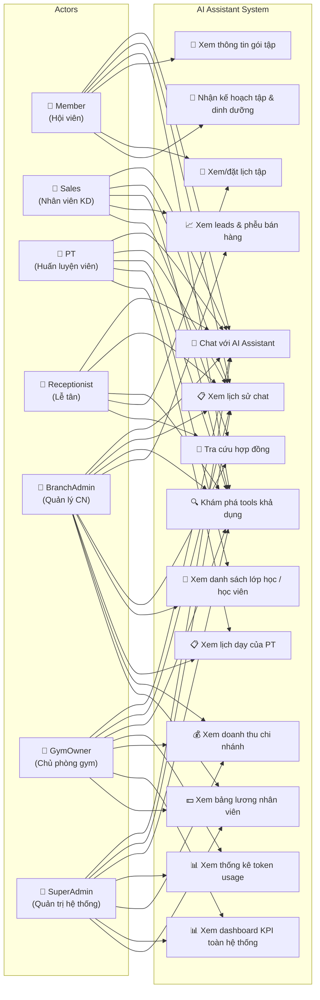
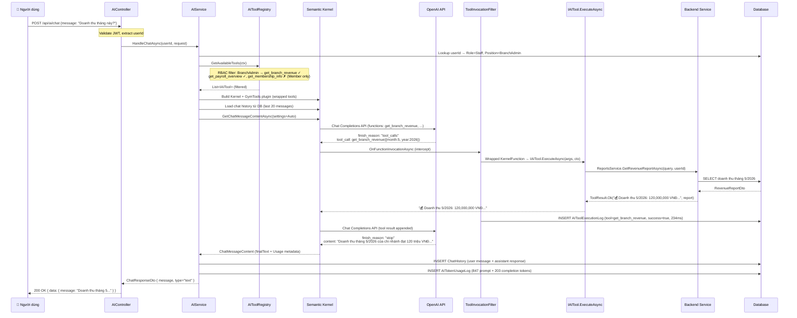

# 🏋️ AI Assistant Module — Tài liệu Kiến trúc & Bảo vệ

> **Phiên bản:** 2.0 — Semantic Kernel Architecture  
> **Framework:** Microsoft Semantic Kernel v1.30.0 + ASP.NET Core 9  
> **LLM:** OpenAI GPT-4o-mini (mặc định) / Ollama (local)

---

## 1. Tổng quan kiến trúc

### 1.1 Sơ đồ kiến trúc tổng thể



### 1.2 Nguyên tắc thiết kế

| Nguyên tắc | Hiện thực hóa |
|---|---|
| **Separation of Concerns** | IAITool = business/RBAC layer; SK = AI orchestration layer |
| **Single Responsibility** | Mỗi tool xử lý 1 domain nghiệp vụ |
| **Provider Agnostic** | KernelFactory swap OpenAI ↔ Ollama qua config, không thay code |
| **Security by Design** | RBAC filter trước khi tools được đưa vào SK Kernel |
| **Observability** | Mỗi tool call được audit log; mỗi chat ghi token usage |

---

## 2. Use Case Diagram



---

## 3. Đặc tả Use Case

### UC1 — Chat với AI Assistant

| Mục | Nội dung |
|---|---|
| **Tên** | Chat với AI Assistant |
| **Actor** | Member, Staff (Sales/PT/Receptionist/BranchAdmin), GymOwner, SuperAdmin |
| **Mô tả** | Người dùng gửi tin nhắn tự nhiên; AI tự động gọi tools phù hợp để lấy dữ liệu thực và trả lời |
| **Điều kiện tiên quyết** | Đã đăng nhập, có JWT token hợp lệ |
| **Luồng chính** | 1. Người dùng gửi `POST /api/ai/chat` với `{ message }` <br> 2. Hệ thống xác định Role + StaffPosition từ JWT <br> 3. AI lọc tools theo quyền <br> 4. LLM phân tích intent, chọn tool phù hợp <br> 5. SK tự động gọi tool, nhận kết quả <br> 6. LLM tổng hợp câu trả lời bằng tiếng Việt <br> 7. Trả về `{ message, type }` |
| **Luồng ngoại lệ** | API Key lỗi → trả về thông báo lỗi cấu hình <br> Tool lỗi → SK tiếp tục với thông báo lỗi, không crash |
| **Hậu điều kiện** | Chat message lưu vào `ChatHistory`; token usage lưu vào `AITokenUsageLog` |

---

### UC3 — Khám phá tools khả dụng

| Mục | Nội dung |
|---|---|
| **Tên** | Tool Discovery |
| **Actor** | Mọi role đã đăng nhập |
| **Mô tả** | Trả về danh sách tools mà người dùng được phép dùng, kèm JSON Schema tham số |
| **Bảo mật** | Member **không thấy** `get_branch_revenue`, `get_payroll_overview` — filtered hoàn toàn phía server |
| **Endpoint** | `GET /api/ai/tools` |

---

### UC4 — Xem thống kê token usage

| Mục | Nội dung |
|---|---|
| **Tên** | Token Usage Statistics |
| **Actor** | SuperAdmin, GymOwner |
| **Mô tả** | Tổng token đã dùng trong N ngày, breakdown theo Role, ước tính chi phí USD |
| **Endpoint** | `GET /api/ai/usage?days=30` |
| **Response** | `{ totalPromptTokens, totalCompletionTokens, estimatedCostUsd, tokensByRole }` |

---

### UC7 — Nhận kế hoạch tập & dinh dưỡng (Member)

| Mục | Nội dung |
|---|---|
| **Tên** | Generate Fitness Plan |
| **Actor** | Member |
| **Mô tả** | AI tạo kế hoạch tập cá nhân hóa dựa trên lịch sử, mục tiêu, gói tập |
| **Tool** | `generate_fitness_plan` |
| **Hậu điều kiện** | Kế hoạch lưu vào `AIRecommendation`; truy xuất qua `GET /api/ai/recommendations` |

---

## 4. Sequence Diagram — Chat có Tool Call



---

## 5. Bảng phân quyền Tools (RBAC Matrix)

### Roles & Positions

```
Application Roles (ASP.NET Identity):
  SuperAdmin │ GymOwner │ Staff │ Member

StaffPosition (chỉ áp dụng khi Role = Staff):
  BranchAdmin │ Sales │ PT │ HeadPT │ Receptionist
```

### Tool → Role/Position Mapping

| Tool Name | Member | Sales | PT | HeadPT | Receptionist | BranchAdmin | GymOwner | SuperAdmin |
|---|:---:|:---:|:---:|:---:|:---:|:---:|:---:|:---:|
| `get_membership_info` | ✅ | | | | | | | |
| `get_available_packages` | ✅ | | | | | | | |
| `get_my_schedule` | ✅ | | | | | | | |
| `book_class` | ✅ | | | | | | | |
| `cancel_booking` | ✅ | | | | | | | |
| `get_attendance_summary` | ✅ | | | | | | | |
| `generate_fitness_plan` | ✅ | | | | | | | |
| `ask_fitness_coach` | ✅ | | | | | | | |
| `get_lead_summary` | | ✅ | | | | ✅ | ✅ | ✅ |
| `get_lead_pipeline` | | ✅ | | | | ✅ | ✅ | ✅ |
| `get_sales_funnel` | | ✅ | | | | ✅ | ✅ | ✅ |
| `contract_lookup` | | ✅ | | | ✅ | ✅ | ✅ | ✅ |
| `get_class_roster` | | | ✅ | ✅ | | ✅ | ✅ | ✅ |
| `get_member_training_overview` | | | ✅ | ✅ | | ✅ | ✅ | ✅ |
| `get_my_teaching_schedule` | | | ✅ | ✅ | | | | |
| `get_pt_performance` | | | | ✅ | | ✅ | ✅ | ✅ |
| `checkin_lookup` | | | | | ✅ | ✅ | ✅ | ✅ |
| `booking_lookup` | | | | | ✅ | ✅ | ✅ | ✅ |
| `member_lookup` | | ✅ | | | ✅ | ✅ | ✅ | ✅ |
| `get_checkin_report` | | | | | | ✅ | ✅ | ✅ |
| `get_branch_revenue` | | | | | | ✅ | ✅ | ✅ |
| `get_branch_payroll` | | | | | | ✅ | ✅ | ✅ |
| `get_global_revenue` | | | | | | | ✅ | ✅ |
| `get_system_dashboard` | | | | | | | ✅ | ✅ |
| `get_payroll_overview` | | | | | | | ✅ | ✅ |

---

## 6. Q&A Phản biện

### ❓ "Tại sao dùng Semantic Kernel thay vì tự viết?"

> Semantic Kernel là enterprise AI orchestration framework của Microsoft, được dùng trong production bởi các công ty lớn. Nó cung cấp:
> - **Auto function calling loop** — tự động xử lý vòng lặp LLM ↔ tool mà không cần viết thủ công
> - **IFunctionInvocationFilter** — hook để audit mọi tool call, tích hợp observability
> - **Provider abstraction** — swap OpenAI sang Azure OpenAI hay Ollama bằng 1 dòng config
> - **Production-tested** — không phải reinvent the wheel với HTTP client, JSON parsing, parallel tool calls
>
> Tự viết sẽ tạo ra technical debt và bug tiềm ẩn (ví dụ: sai format assistant message khi có tool_calls).

---

### ❓ "Nếu đã dùng Semantic Kernel thì IAITool để làm gì?"

> Đây là **Separation of Concerns** có chủ đích:
>
> - **IAITool** = business/RBAC layer — nơi đặt logic "ai được làm gì"
>   - `AllowedRoles` → SuperAdmin, GymOwner, Staff, Member
>   - `AllowedStaffPositions` → BranchAdmin, Sales, PT, HeadPT, Receptionist
>   - `ExecuteAsync` → gọi existing backend services (không duplicate logic)
>
> - **Semantic Kernel** = AI orchestration layer — nơi đặt logic "LLM gọi tool như thế nào"
>
> SK không có khái niệm `StaffPosition`-based filtering. Nếu bỏ `IAITool`, phải nhúng RBAC logic vào SK internals — vi phạm Single Responsibility và rất khó test.
>
> `SkToolHelper.WrapAsTool()` là bridge layer: convert IAITool → SK KernelFunction mà không thay đổi business logic.

---

### ❓ "Tại sao dùng `FunctionChoiceBehavior.Auto()` thay vì chỉ định tool cụ thể?"

> `Auto()` cho phép LLM tự quyết định khi nào cần gọi tool và gọi tool nào. Đây là chuẩn của modern AI agent:
> - LLM đủ thông minh để không gọi tool khi không cần (ví dụ: câu hỏi chào hỏi)
> - LLM có thể gọi nhiều tools song song trong 1 lượt (parallel function calling)
> - Không cần hardcode "câu hỏi về doanh thu → gọi tool X" như intent routing

---

### ❓ "Chi phí vận hành AI module như thế nào?"

> Có thể xem real-time tại `GET /api/ai/usage?days=30`.
>
> Ước tính với **gpt-4o-mini**:
> - 1 chat turn trung bình: ~800 prompt tokens + 200 completion tokens = 1,000 tokens
> - Chi phí: $0.15/1M prompt + $0.60/1M completion ≈ **$0.00024/chat**
> - 1,000 chats/tháng ≈ **$0.24/tháng** — cực kỳ rẻ so với tính năng mang lại

---

### ❓ "Security — làm thế nào đảm bảo Member không dùng được admin tools?"

> Ba lớp bảo vệ:
>
> 1. **RBAC filter trước SK** — `AIToolRegistry.GetAvailableTools(ctx)` chỉ trả về tools phù hợp role. Member không bao giờ nhận được `get_branch_revenue` trong danh sách → LLM không biết tool đó tồn tại → không thể invoke
>
> 2. **ResolveAuthorized trong Registry** — nếu LLM cố tình gọi tool không trong danh sách, registry trả về null và log UNAUTHORIZED
>
> 3. **JWT trên mọi request** — không có token hợp lệ = 401 Unauthorized từ middleware, không đến được AIService

---

### ❓ "Hệ thống có thể mở rộng thêm LLM Provider khác không?"

> Có. Chỉ cần thay đổi config `AI:Provider`:
> - `OpenAI` → OpenAI API (default)
> - `Ollama` → Ollama local server (OpenAI-compatible API)
> - Thêm provider mới (Azure OpenAI, Anthropic) → thêm case trong `KernelFactory.Create()`, không đụng đến tools hay business logic

---

### ❓ "Tại sao không dùng Semantic Kernel Plugins với [KernelFunction] attribute trực tiếp?"

> **Hybrid Wrapper Pattern** được chọn vì:
>
> 1. `[KernelFunction]` attribute gắn coupling SK vào business layer — nếu sau này đổi framework, phải rewrite toàn bộ tools
>
> 2. RBAC filtering (`AllowedRoles`, `AllowedStaffPositions`) không thể express bằng `[KernelFunction]` — cần metadata riêng trên `IAITool`
>
> 3. `SkToolHelper.WrapAsTool()` là thin bridge — 30 dòng code, convert IAITool → KernelFunction on-the-fly. Tools hoàn toàn independent với SK

---

## 7. Kết luận kiến trúc

```
Kế thừa từ existing backend (không duplicate):
  ✅ ReportsService, LeadService, ClassService, AttendanceService, PayrollService
  ✅ Repository pattern, EF Core, Identity

Thêm AI layer (clean architecture):
  ✅ IAITool → domain-organized, RBAC-aware, testable independently
  ✅ AIToolRegistry → centralized authorization, single responsibility
  ✅ Semantic Kernel → enterprise AI orchestration, provider agnostic
  ✅ ToolInvocationFilter → observability, audit trail
  ✅ AITokenUsageLog → cost monitoring, production readiness
```
